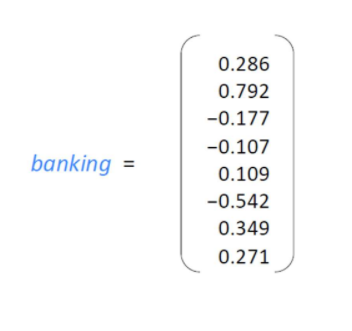

# Data Representation Design Pattern

모든 머신러닝 모델의 핵심은 특정 유형의 데이터로만 작동하도록 정의된 수학적 함수이다. 동시에, 실제 머신러닝 모델은 수학적 함수에 직접 연결할 수 없는 데이터로도 작동할 수 있어야 한다.

>데이터 표현
>
>입력데이터를 모델에서 예상하는 형식으로 표현하는 것

- Feature engineering(특징 가공)
  - 입력 데이터를 표현하는 특징을 생성화는 과정, 또한 데이터 표현을 선택하는 방법으로도 볼 수 있다.

## 간단한 데이터 표현

### 수치 입력

- 스케일링이 필요한 애유

상당수의 ML 프레임워크는 [-1, 1] 범위 내의 수치에서 잘 작동하도록 조정된 Optimizer를 사용하기 때문에 입력값이 이 범위에 속하도록 수치를 스케일링하는 것이 좋다.

스케일링이 중요한 또 다른 이유는 일부 머신러닝 알고리즘 및 기술이 서로 다른 특징의 상대적인 크기에 매우 민감하기 때문이다. 모든 특징을 [-1, 1] 사이에 있도록 스케일링하면 서로 다른 특징의 상대적 크기에 큰 차이가 없도록 만들 수 있다.	

- 선형 스케일링

  - 최소-최대 스케일링

    - 입력이 취할 수 있는 최소값은 -1로 변환하고 최댓값은 1로 변환하는 선형 변환이다.

    

  - 클리핑, 윈저라이징

    - 클리핑과 윈저라이징은 주어진 데이터의 이상치를 제거하거나 대체하는 기술이다.

    - 윈저라이징은 일정 백분위수(예: 상위 5%)를 사용하여 데이터의 극단값을 해당 백분위수의 값으로 대체하는 방법이다. 이를 통해 이상치의 영향을 줄이고 데이터를 안정화시킬 수 있다.

      
  
  - Z 점수 정규화
  
    - 평균을 0으로, 표준 편차를 1로 만드는 방법
    - 스케일링된 값의 범위에는 제한이 없지만 대부분의 경우 [-1, 1] 사이에 존재한다.

## 디자인 패턴 1: 특징 해시

특징 해시(Hashed feature) 디자인 패턴은 카테고리 특징과 관련해 발생 가능한 세 가지 문제인 불완전 어휘, Cardinality로 인한 모델 크기, Cold start를 해결한다. 이 디자인 패턴은 카테고리형 특징을 그룹화하고 데이터 표현의 충돌이 가지는 트레이드오프를 인정하는데서 출발한다.

- 임베딩이란?

임베딩이란 위와 같이 **사람이 쓰는 자연어를 기계가 이해할 수 있는 숫자의 나열인 벡터로 바꾼 결과 혹은 그 과정 전체**를 의미한다.
