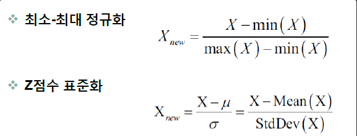
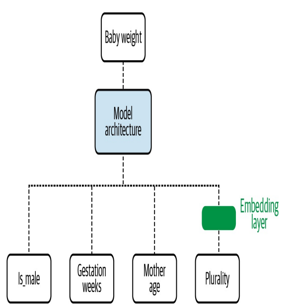
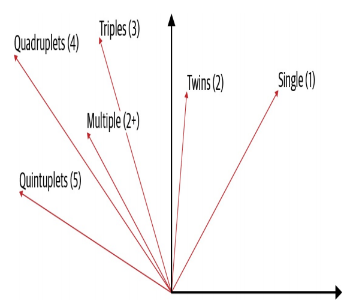
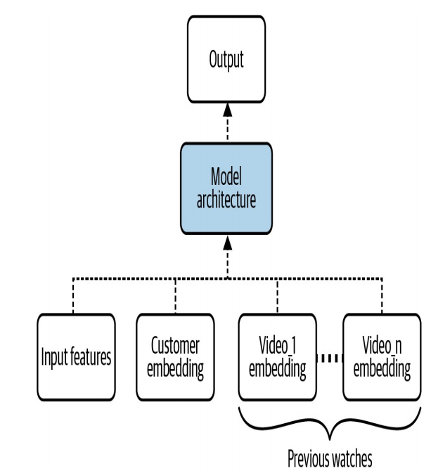
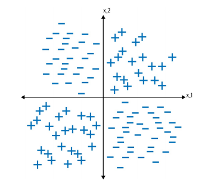
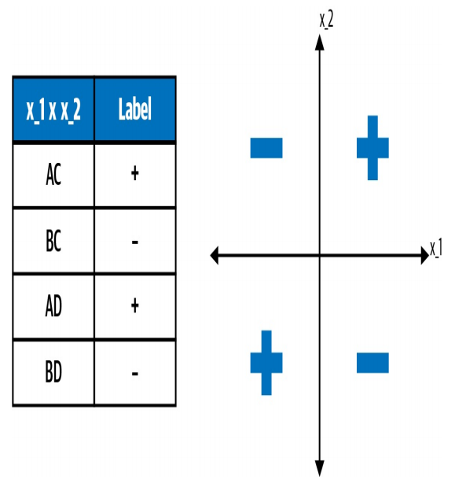

# Data Representation Design Pattern

## Simple Data Representations

### Numerical Inputs

- 스케일링이 필요한 이유

1. 상당수의 ML 프레임워크는 [-1,1] 범위 내의 수치에서 잘 작동하도록 조정된 옵티마이저를 사용하기 때문에 입력값이 이 범위에 속하도록 수치를 Scaling하는 것이 도움이 된다.

2. 데이터를 [-1, 1] 범위에서 '중앙에 배치'하면 loss function이 더 완만해진다. 따라서 이 범위로 스케일링된 데이터로 학습시킨 모델은 더 빨리 수렴하는 경향이 있어, 학습 속도가 빨라지거나 비용이 저렴해진다. 또한 [-1, 1] 범위에서 가장 높은 정밀도를 얻을 수 있다.
3. 일부 머신러닝 알고리즘 및 기술이 서로 다른 특징의 상대적인 크기에 매우 민감하기 때문이다. 모든 feature를 [-1, 1] 사이에 있도록 스케일링하면 서로 다른 feature의 상대적 크기에 큰 차이가 없도록 만들 수 있다.

- Linear 스케일링

1. Min-max 스케일링
   - 입력이 취할 수 있는 최소값은 -1로 변환하고 최댓값은 1로 변환하는 선형 변환이다.
   - 문제점
     - 최댓값과 최솟값을 학습 데이터셋 내에서 추정해야 하며, 이러한 값이 Outlier 값일 가능성인 높다는 것이다. 
2. Clipping(Min-max 스케일링과 함께 사용), Winsorizing
   - 주어진 데이터의 이상치를 제거하거나 대체하는 기술이다.
   - Winsorizing은 일정 백분위수(예: 상위 5%)를 사용하여 데이터의 극단값을 해당 백분위수의 값으로 대체하는 방법이다. 이를 통해 이상치의 영향을 줄이고 데이터를 안정화시킬 수 있다.
3. Z-score normalization
   - 평균을 0으로, 표준 편차를 1로 만드는 방법
   - 스케일링된 값의 범위에는 제한이 없지만 대부분의 경우 [-1, 1] 사이에 존재한다.

> Min-max 스케일링 및 Clipping은 균일하게 분산된 데이터에서 가장 잘 작동하는 경향이 있고, Z-score normalization은 정규 분포를 따르는 데이터에서 가장 잘 작동하는 경향이 있다.

- Non-linear 변환

Uniform 분포나 Normal 분포가 아니라면 스케일링 전, 입력에 Non-linear 변환을 적용한다. 일반적인 기법은 스케일링 전에 <mark>입력값의 로그를 취하는 것</mark>이다. 제대로 된 변환 함수를 적용했다면 변환된 값의 분포가 균일하거나 정규분포를 따르게 된다.

하지만, 분포를 종 곡선 처럼 보이게 하는 Non-linear 변환 함수를 고안하는 것은 어렵다. 더 쉬운 접근 방식은 조회수를 버킷화하여 원하는 출력 분포에 맞는 버킷(bucket) 경계를 선택하는 것이다. 

이러한 버킷을 선택하기 위한 원칙적 접근 방식이 <mark>히스토그램 평준화</mark>이다. 여기서 히스토그램의 bin은 원데이터 분포의 분위수를 기반으로 선택한다.

bin: 히스토그램으로 표현될 변수의 전체 범위를 몇개의 막대로 표현할지에 대한 설정

치우친 분포를 처리하는 또 다른 방법은 <mark>Box-cox transform</mark>과 같은 parametric transformation 기술을 쓰는 것이다.  Box-cod transformation의 목적은 모든 조회수 범위에서 분산을 동일하게 만드는 것이다.

![Box Cox Transformation 파이썬 박스 콕스 변환 Skew 조절 [빅공남! 통계 같이해요] - 수학구조대(빅공남)](data:image/png;base64,iVBORw0KGgoAAAANSUhEUgAAAWEAAACPCAMAAAAcGJqjAAAAgVBMVEX///8AAAD7+/vc3Nxvb2/v7+83Nzf29vb5+fnV1dXy8vI7OzuDg4PR0dHAwMDn5+eqqqq3t7fk5OQrKytKSkqAgICNjY0wMDBDQ0PFxcVqampYWFiTk5MtLS1iYmKjo6NQUFAVFRUeHh6bm5t4eHiurq4ODg4aGhqQkJAkJCRVVVXQcc/tAAAQUklEQVR4nO1diZKiOhQ1gbDKFpBddlD8/w98CaCCDQq2dvt6ODU1To2IcrjcJbk52WxWrFixYsWKFStWrFixYsWKFStWrFixYsUZkBfuvw1/6pf8UfCqXfLTb0P1WGorx9+AFjqgkKbfF8oEFNrP/Z4/B6YAIFLuHQE9U757wIp7EP2q2jL3j5FYEK9u4klgYsE+fnSUDqIlbkJi1vtxhhCmwHnsAUR5xkEX4DB6eM/+GYgyqOy7qVoDvgDh46MoJK8Mg8p54Hb+HfAhAK74+DiNBcE8N6G4tUkei5XhDjgBdxO1DiiUs1qdd8YwjIOV4QvUGlT6w6iEwv2RrXbzohfc8LuV4TNgXoHMGGMOMbip8gTEb9DR3CKjdudGL2ll+AL+CMYzCWbnnnJEyzk/F4/7Am9wBPR5sW5luAfeBkAeCXRM4XLA8UiEC0BQ1D7TxMRgphGvDF9BPOYYwzDn4rxKS5IZOGBrRx79T7EIZqbEhOH9WmS3QMWol8BJxISAJg9xmhk8ah31+bUBvEH/46sNX0G4GGV4WyoJ8DVaaIxny+J2iGOf0ZXhK6a8BJLKGsTCBlvARyOfg4ZrDRB4vXdXhq+QivFItxGIkyC27WXApg6Avx2fRyIzRP+AleErJmyY5BA+SNAGxiRb3tA67ThmyVNYGb6C304wzFiAhRvEtm5Yr7gZYxfXs64MXzDNMAl0vGQ4NNyR2jrK70zjDQERViJgGgjN/shfxiTD/LHiclsGIOQpaczjwaEzNDtyK3JWtvAeH/z3McnwRvTNQ5aByoAbqdzem4m+AXPiZNmRZY4rX/Yz/8eguUQ6YmtSGSuiVybAYkhaYZn1fHsUtDNWL0FAQhnIRtgzsrRAm9IEubBREj1K540Nr/gCmq1xI0MINgCRxkRVQFIC40TKi7enBjwj9hJC/kGTEVSM+ZHhVzHFcAgObBxlkQppcZGn9nueeB7jliioHAN3p5xpFcOjcXfOCrHWzZPHI+0jOZ9imGHlPXeK2zl5FDmG8Q4jhqUst2mgx1XuAQTnLzFIEsPe+0ZDDgf3XPDsKCmMJWXRD2GK4Y2mqB7uBtzVLCqtdzhinjYbUVvFESjK/TWrkZQApHcmt5B/GiRAvCHvfVY2t5/X+iWNj14OEVdRwb7jtwtHAApqd0ZVGwxr7a4j/EYK2GmLVJ1hBaS4Wawhlfz9cY0wkzbch5LI/nuqB2W3U8mDAmPgiBvE9Po7cTKRp1MgNhm8J9lNq4Fgg+TjGmFmMQxF9V2pRDtyD/MvDxIx7yqf+pRq5oMZQ8YCO2rTepp9XFY5i+G3ATGi5/EkoziCvaoN/ZBqgmAiOdDYZHjHPRM0yY5Rz21M+jn8KsNoK7ucr22MgAOVdRoO9WvR5FxfKecDdwvLCjRhUXVaW/4k0EhX/x7DDqDxzDg5oHKTYWSjnRwDX0DMvYUROHHzj/PxQg5A2TF8Jzz+DjQfgOq3xsAgJq6AUIIYG+wNBg/zAI8bdA9Ihblv4Jig2juOs5fPnTS0JeFsw9GnMcyP2jB6GR48s8htjK7NJYaAcQ0O/bjlxS1sxwp1Q1XVS9VHGS7fwjAqld5tx/frzHGMjl5qW/ZVmEwHum+6Mnxzm/nSzSpw7N+htmtA0B39ZtCi7yVG522fhRQnKtwIotLWXgxrL6d4lGEccC+CU9z/emQ1DBOKzKGr4ktOtmWQfM0StehL8zfUz5FuP6ePdDag4cbkFmOfa1tyoBfEi1OVUYYhZl6FB/e8s2Hh1oZ5natzvGunYbsfxYgN4toWu39eDNyo2iyNZGvbF+YSOGpKesiwoG07hfGcVushpuc4fgSdDd96CaE0QShR4ooLYZrPuRRZJbsdLmavcOeKo6Jls4RfUjvDWO5maYzaap8b0Vo8yChNzeb/DNCoH+Zjp1m+h61ewxFvxLqux9Fhq59x8RYkI2Kpd8ibKXGmOOmv8BXI73glJXzaPkxSYS0ty3/VhiFSZBCJEs3Wspw5xygp3gOWXoiwBek1JW4KbCa6LInqtcrxOaDL/XBE7xe5XcB9RYovumxnsCRZaW2XJDhLy/JfZRjZLgDpSc+Dmry6XcELiTeN2p9E/jWMdcQRGl/PQ8gIQGSou1RWG6cODo/b+h/DcOzzWZSsm+RR0nzhmZ9lWJJeUP9rO9dNAiu0rVNyCqxtx7DeEEWB2RQMJqyZ0/goKhTZrEqrgA7UbRS2rpbyMIbYjC/f67bp4IZZPNvzJMNeFG29b0dtqGGMNYwQ+Usjf7r/Rt4lS9AUb8BoLo+acPOhMjZaHwmR7sQThy3BlWEU1u049ganu4Uu/kmGFdYElvfjo904uTMR0OthDp2pG7EEF4ZRbu04uclcCMMLSxo01Xt5HxBv226gH4UQc+qcu8pY0SvGs/WOYWRzoea3o9XMUwzPXZ0xgGeCH19YKybFnMtDO7N8xSixxzWRTttlW7SJD00SIy72w1oEwFLP0oDcGvOH5xPQbl7nEcPmLymdGYvWO9o2pdOHjFuXdCR6cZaikHwpf+aGQx28tEKdAd7I5z2hL2qcQCyd/BNPjcvhbZnEAH5rLh3qNTJQPxcVFGdsXOatgD87Q0SSb5U2Foht04goChscLNKA2LQjq4+1JcY/yj57bz4ZSDUaQnlGIXxG7M3TUO6XXjJxEqnxpGWU2edNin0XTOFkFslXoJG4HvG61nBBshjdhNrbJW/w1knTWbqnB1RFF3B/bCkBKlw2o0MQ5NmmC2JRHvXnOLSdP0xsebU0BijLoUOAxAznLvP8AiGvAfhjPdiqmXsyHabTgrbbC+X9J5yxb8jSitpsUGfdqzsow6DngmRWCj8Cvtybh8+b2f0WpIJT1APNrcQ9aHVjhuzccgVFtYPRvSp9j8AbFoierXyluJapTsefWqohqCWzA3SIuezPrjwNjwP+s4pSUpjtDZQ/mUt/LCAUE/pc0rXGLxhhFi0QeM8RJMX7OpQ23v7ZVO9jYdR0TpWuNaZuWGLuJ0vQu4l0htp3m4KREDf8DMUoNw+0U1fzgfNxnXjfQ17R7hGlbuY0UGjdD1Ma20W6C2T1NtI9OMX4ee0UFNR26XzN0qGmzwYsgMxQrZLGDSvcA1UYKHrKDW5yX/JMnJYPXZZpO41GHI0DXjIS+zkIK8dDhtu6YRTH37Uf3q6q5QmXd+qm0TZSnlg/Pkr8VigkOPkyaNwwr+HvDyGRaJeOKlXdA89cUhCJEf9UqONx7Ceum9JhQxQH7PeTUbRrb9eKBnxcxFgTd1R/B5ZBUL1g4EU1f3wg/YMhcoDzqKcoSOEc5fbh+P2pSCb5a1XDd+ClwPVEtko8KhocR6/IReks0qzJr38CjAXc4mT6KnUOvLGPXiB+//RM6J8ENArLYss2MEE7C/X42454Uufn3wSUNE3q7JZxZT1a3i98i1/ubv1kYMuJXtB3sdrwJHiSDz87et4/zcrwJHj8il1eVi/xbqwMvxurl3g3Vht+N1aG342V4XdjZfjd+FX1g38CVDPw19QP/glQG163HXgnGhWa1Q+/Eb+rpPQvYGX43VgZfjdmqTKu+AZWG343nmAYYmVqcpoR18aAW4wzDO8pWItsMlGiwNxaoMh/AwH3m3W/LOr534L/svOUoIahfWeDbMxyky2f2HeWdcFBjDtaxTywikvDuGiHS7XNoIQ+8gFCXzQDpS0AwJ1kmN/SddRTUNxkicuBupWETX+jl5hudV2LrrppfVdD+8uZlJCNduoH9tbQXGK4l4Gg7kwwKawP1foehzDOlrRsSywAJ2qrWgT8uL7qJvFKsEhJhlcTJ2JlJ/w8isdGL6VgmmGtuN/mhpMlvV7026nIHzQOWYlZeXf1DGW6ZC2l4h5yjAyu1ud/+Q9hjGHoTzIMy2zagTQIqyWLTJWiaUlo1cCw2NfQthaMW/NXDe2Pa9VdyDBx0tv78cRzFhUwfCey9WX4iZA2raF9CyZpl1jH1QdqaE8yrImi4mmSyDC93UHJpXTrNqAmtmkAP9ycRztV81WMsCh6Ck9OkQPHQ0Mfapggmvs0ePtWD63MwCtEql6KUYYLmksYSeJaep4kSXFdOOo53YSI4LFuRBsTUR4NEjS+mC/swYeJJbNooxYWSCN2mKPgYHY5TzW0405Z9OPkAsb6JSDbMEzV5lwu8rmeUkeZdsvxlcBtFTwUGWz7piaE8yWAJfvQRDojaDS0h8K2MOxoOwPf7pt5qVDId7Zr2KmG9qdtLCON1HTESxCGeYakUo4uCHoFzj2eMO9Cica6it3sNqynVBISovOFEZf6IBb2gIxGQ5vXQrBXb7wEXRXcFyRBbKss6sqdsqh8URalOiTNzaCe5dPyNeolvjDMNpEO0oSJ/F7vKjkrbNv0daNyW5LCWiL9vMxsoOdf9hE10gVzJtMKz3TxP+grJ7XKolRctHvV43N98n9lmG7rQqUoPfPCMPEpQcuwryqNz8MRvSbJvpZj3mHB3PWEOu6Grgm2sqGk20WGRDi/Xo4N36VS/gLcy9bUQ0XLKhKoLwwX3RUIEh8D02hiiw0JHddo+AzDQn47HSsYnLPjwGmWw7lqaDsv1dB+Ccb0h88MG2lFLYPY8FlnmaT0p841IhacMDG+FOh057LrdamHsR0FJ9BjePAhvqwPMakfs54Iy5dI19PQTltrJ9naDyuUPQZ1YZN+uGoUqQnD5xToEuk2G7HJISQqeAGVbVReIt2ijYcnvARfcsDWNgboaWijwrnRmL/ujUQTmr6G9iftnwnj6suSxTaXoG+1DPeSTCM9JwrEDecCXR4VIVxE2aUIpDdh/tqmCQ3t0m3WpjNuT0MbGvYN8kumcdHQbk6D7esN/wAQpqpyUAfxKCIVliSgvAKFxvNqTS63o9hzzO6SFRPkPJ+npJjS/ZK7ZGjEsc9fi86LJDQxAo+3IMvP30Fl9luJZ2EHqvD626aVt4iXoa4O+TS7pl7Z/aA2Ji0AQ0qEkipayzudLlHPTjlLKo8s6baDY5KqM3hiNlZY1CAzeLuIr9qZ5PbMdoXo6FbgcCrzwATgkJwH7cgt7RS0jHp6lG8A8QRIdrM90A2M4as0tF8Eql8pD/YR0N3TKZHZOIiiwHLDKPLJy7FlEBXgbFSKz9X7A32MaW1yUZkQ3XS2RBiyrSDyT3kY+JEfnexOQ7uszyaICzObxRVUfNOsDyed2grDmu/a1/Qp4BOoBlaHaMwWMRW2Jq8agzVGPKvgw/LQpmtMHCueQfccQDTQnNS4szU9W6CGqTH07NqNhrZmXOS5sTp3f1Js5KHeTcRq+f6T1mrT/Yfmi3rhqBHzh+Eh1SF5HqkOJAxTO+xEPRBbHX/JfHq6ozn3UcotuKjA7LWPgt6ISNOm2FzyXEBnJYRtGp26BcCemfx+nyFOXqKh/TrgXQX8ubwg1tQFmjGYx9A9tDsxeZEbto+4Fh3uaw/9BDDrlJ8T6BrgY10lc3+UEtB2Cc93ZYstW/d82S4c5YcP2M8X+09swfVmIN2dXdALhhXhjYAVT7ldlApLh/0AJQWIP230Z0OnLI6zZYh59TjhUoTS/iz/t2LFihUrVqxYsWLFihU/jf8A2rofO1oXX7wAAAAASUVORK5CYII=)

- 수의 배열

입력 데이터가 수의 배열일 때도 있다. 수의 배열을 처리하는 일반적인 방법은 다음과 같다.

1. Representing the input array in terms of its bulk statistics. For example, we might use the length, median, mininum, maximum, and so on.
2. Representing the input array in terms of its empirical distribution.
3. If the array is ordered in a specific way, representing the input array by the last three or some other fixed number of items. For arrays of length less than three, the feature is padded to a length of three with missing values.

위의 방법들을 통해 가변적인 길이를 가지는 데이터 배열을 고정된 길이의 feature로 표현할 수 있다.

---

### Categorical Inputs

대부분의 최신 대규모 머신러닝 모델은 수칫값으로 작동하므로 카테고리 입력도 수치로 표현되어야 한다.

| Categorical input | Numeric feature |
| ----------------- | --------------- |
| English           | 1.0             |
| Chinese           | 2.0             |
| German            | 3.0             |

위와 같이 단순한 mapping table을 쓸 수 없다. 언어 간에 서수 관계가 없기 때문에 모델이 이러한 언어로 작성된 책의 인기를 독립적으로 학습할 수 있도록 하려면 categor to numerical mapping을 사용해야 한다.

- One-hot encoding

변수의 독립성을 유지하면서 Categorical input을 매핑하는 가장 간단한 방법은 one-hot encoding이다. 아래의 테이블과 같이 매핑이 가능하다.

| Categorical input | Numeric feature |
| ----------------- | --------------- |
| English           | [1.0, 0.0, 0.0] |
| Chinese           | [0.0, 1.0, 0.0] |
| German            | [0.0, 0.0, 1.0] |

One-hot encoding을 사용하려면 미리 categorical input의 범주의 집합(vocabulary)을 미리 알고 있어야 한다. Numeric feature의 길이는 vocabulary의 크기와 같다.

- When the numeric input is an index
  - 인덱스로서의 숫자는 임의적이므로 카테고리(Sun, Mon, ... ,Sat)로 처리하는 것이 좋다.

- When the relationship between input and label is not continuous

  - 금요일의 교통량이 목요일과 토요일의 교통량에 영향을 받지 않기 때문에, categorical feature로 취급하는 것이 적절한 선택이다.

- When it is advantageous to bucket the numeric variable

  - Input의 수(예. 요일의 수)가 feature의 수(예, 주중 or 주말: 2) 보다 큰 매핑을 bucketing이라고 한다.

  - Bucketing은 데이터를 더 이해하기 쉽게 만들어 줄 수 있지만, 연속적인 값이 가진 순서 정보를 훼손할 수 있다.
    - 예시로 연령이라는 값은 순서를 가지고 있는데, Bucketing을 하게되면 범주로 묶기 때문에 일부 정보가 손실되는 것이다.

- When we want to treat different values of the numeric input as being independent when it comes to their effect on the label
  - 쌍둥이 여부를 Categorical input에 mapping하는 예를 생각해보자.  Categprocal input을 쓰면 모델이 쌍둥이 여부에 관련된 서로 다른 값에 대한 독립적인 조정 가능한 파라미터를 학습할 수 있다.

- Array of categorical variables

  카테고리형 변수의 배열을 처리하는 일반적인 원칙은 다음과 같다.

  - Counting
  - Relative frequency
  - Representing the input array by the alst three items
  - Bulk statistics

이 중 가장 일반적으로 쓰이는 것은 Counting과 Relative frequency이다. 이 두 가지 모두 one-hot encoding을 일반화한 것이라고 볼 수 있다.

---

## Design Pattern 1: Hashed Feature

Hashed Feature 디자인 패턴은 categorical feature과 관련된 세 가지 문제: incomplete vocabulary, model size due to cardinality, cold start를 해결한다. Hashed Feature 패턴은 데이터 표현에서 발생하는 collision이 가지는 trade-off를 인정하는 것에서 출발한다.

### Problem

1. Vocabulary를 알기 위해서는 training data에서 추출해야 한다. Training data에 모든 병원과 환자가 포함되지 않기 때문에 vocabulary가 불완전해진다.
2. Categorical 변수는 높은 cardinality를 가지고 있다. 높은 cardinality로 인해 특징 벡터의 길이가 길어지게 되면 학습 문제 뿐 아니라, 모델 저장을 위한 큰 메모리를 차지하는 문제가 발생하게 된다.
3. 모델이 배포된 이후에도 새로운 병원이 건설되고 새로운 의사가 고용될 수 있다. 모델은 이에 대해 예측할 수 없으므로, Cold start 문제를 해결하려면 별도의 인프라가 필요하다.

### Solution

Hashed Feature 디자인 패턴은 다음과 같은 방식으로 categorical input 변수를 나타낸다.

1. Categorical input을 고유한 string(문자열)로 변환한다.
2. Categorical input을 string으로 변환하기 위해  무작위성이 없고, 다른 환경에서도 동일한 결과를 보장하는 hashing algorithm을 사용한다.
3. 나머지를 이욯안 bucket 할당: 나머지가 음수가 될 때에는, 절댓값을 사용하여 양수로 변환한다.

### Why It Works

Hashed Feature 디자인 패턴이 앞에서 말한 세 개의 문제를 어떻게 해결할 수 있을까?

- Out of vocabulary input
  - 목록에 들어있지 않았던 dataset도 hash algorithm을 통해 변환하게되면 이미 정해져 있는 bucket의 범위 안에 들어오게 된다.
  - 공항이 347개 있으며, 10개의 버킷으로 해시했을 때 평균 35개의 공항이 동일한 해시 버킷 코드를 받게 된다. 학습 데이터셋에 새롭게 추가된 공항은 해시 버킷에 있는 다른 약 35개의 공항의 feature를 'borrow' 한다.
  - 경험상 버킷이 약 5개의 항목을 가지고 있을 정도로 버킷의 수를 선택하는 것이 좋다. 앞의 공항의 경우 약 70개의 해시 버킷이 좋은 선택이 될 것이다.
- High cardinality
  - 충분한 수의 해시 버킷을 선택하면 cardinality 문제도 해결된다. 수백만개의 카테고리가 있어도 이를 수백 개의 버킷으로 hash하면 문제를 해결할 수 있다.
- Cold start
  - Out of vocabulary input과 비슷하다.

### Trade-Offs and Alternatives

Hashed Feature design pattern에서 key trade-off는 모델 정확도의 손실이다.

- Bucket collision
  - 하나의 버킷을 다수의 요소가 공유하기 되는데 이를 bucket collision이라고 한다.
  - Bucket collision을 완전히 피하기 위해 버킷 수를 굉장히 크게 늘릴 수 없다. 크게 늘린다 해도 최소 2개의 공항이 버킷을 공유할 확률이 45%이기 때문이다.
  - 따라서 bucket collision을 용인하는 경우에만 Hashed Feature deisgn을 사용해야 한다.

- Skew

  - Categorical 입력의 분포가 치우쳐져 있는 것, 즉 skew가 높으면 모델의 정확도 손실이 심각해진다. 아래의 표와 같이 같은 bucket에 있는 공항들의 편차가 심하다면 모델 정확도의 손실이 심각할 것이다.

  | departure_airport | num_flights |
  | ----------------- | ----------- |
  | ORD               | 3610491     |
  | BTV               | 66555       |
  | MCI               | 597761      |

- Aggregate feature

  - Bucket collision이 자주 발생하는 경우 model의 input으로 aggregate feature을 추가할 수 있다. 특별한 정보를 모델에 추가함으로써, 카테고리 데이터 특성을 더 잘 활용하고, 모델이 더 효과적으로 학습하도록 도울 수 있다.

- Hyperparameter tuning
  - Bucket 수를 하이퍼파라미터로 취급해서 조율하는 방법을 권장하고 있다. 버킷 수를 적용했을 때, 해시된 카테고리형 변수의 카디널리티가 합리적인 범위 내에 있는지도 확인해야 한다.

- Cryptographic hash
  - Binary encoding: Out of vocabulary input과 cold start 문제를 해결하지 못한다.
  - IATA code: 동일한 문자로 시작하는 공항 사이에서 spurious correaltion을 생성한다.
    - 이렇게 만들어진 spurious correaltion은 binary space에서도 유지되며 이 때문에 farm fingerprint값의 binary encoding을 권장하지 않는다.
  - MD5 hash: 결정론적이지 않고 유일하지 않기 때문에 적절하지 않다.
  - 결론적으로, <mark>fingerprint hashing algorithm</mark>을 사용해야 한다.
- Order of operations
  - 나머지 연산을 수행한 다음 절댓값 연산을 수행한다.
- Empty hash buckets
  - Hashed feature 열을 사용할 때 빈 bucket과 관련된 weight(가중치)가 거의 0에 가까워지도록 L2 일반화를 사용하는 것이 좋다.

---

## Design Pattern 2: Embeddings

Embedding은 학습 문제와 관련된 정보가  보존되는 상태로 높은 cardinality의 데이터를 lower-dimensional space에 매핑하는, learnable data representation의 일종이다.

### Problem

Machine Learning 모델의 학습 데이터는 categorical feature, text, image, audio, time series 등과 같은 다양한 형태를 가질 수 있다. 다양한 유형의 데이터를 학습하기 위해 model의 학습 패러다임에 맞는 수치로 된 특징값이 필요하다.

One-hot encoding의 문제점

1. 큰 cardinality를 가지는 categorical feature을 one-hot encoding하면 밀도가 낮은, 머신러닝 아록리즘에 적합하지 않은 행렬이 생성된다.
2. Categorical variable을 독립적으로 취급한다.

아래의 표는 lower dimensionality embedding을 통한 출생률 데이터셋의 쌍둥이 항목 표현

| Plurality      | Candidate encoding |
| -------------- | ------------------ |
| Single(1)      | [1, 0, 0, 0]       |
| Multiple(2+)   | [0, 0, 0, 6]       |
| Twins(2)       | [0, 0, 0, 5]       |
| Triplets(3)    | [0, 0, 0, 7]       |
| Quadruplets(4) | [0, 0, 0, 8]       |
| Quintuplets(5) | [0, 0, 0, 9]       |

이와 같이 embedding design pattern을 사용해 closeness를 낮은 차원에서 표현할 수 있다.

### Solution

Embedding layer의 weight는 출산율 모델을 학습할 때 gradient descent 과정에서 학습된다.

embedding은 one-hot encoding된 저밀도 벡터를 R2의 고밀도 벡터로 매핑한다.

| Plurality      | One-hot encoding   | Learned encoding |
| -------------- | ------------------ | ---------------- |
| Single(1)      | [1, 0, 0, 0, 0, 0] | [0.4, 0.6]       |
| Multiple(2+)   | [0, 1, 0, 0, 0, 0] | [0.1, 0.5]       |
| Twins(2)       | [0, 0, 1, 0, 0, 0] | [-0.1, 0.3]      |
| Triplets(3)    | [0, 0, 0, 1, 0, 0] | [-0.2, 0.5]      |
| Quadruplets(4) | [0, 0, 0, 0, 1, 0] | [-0.4, 0.3]      |
| Quintuplets(5) | [0, 0, 0, 0, 0, 1] | [-0.6, 0.5]      |

### Why It Works

앞에서 예로 들었던 6차원 공간에서는 그 내적이나 cosine similarity가 0이 된다.  하지만 categorical 변수를 더 낮은 차원의 embedding space로 강제함으로써 다른 category간의 관계를 학습할 수 있다.

따라서 학습된 embedding을 사용하면 2개의 개별 카테고리 사이의 유사성을 추출할 수 있다.

20차원 공간의 customer_ids와 같은 categorical feature를 다룰 때에도 동일하게 적용할 수 있다. Machine Learning 모델에서 사전 학습된 embedding을 사용하는 방식을 transfer learning이라고 한다.

### Trade-Offs and Alternatives

Embedding을 사용하면 데이터의 표현 정보가 손상된다는 단점이 있다. 저차원 공간으로 이동시키는 과정에서 정보의 손실이 발생하지만, category 간의 밀착도에 대한 정보를 얻을 수 있다.

- Choosing the embedding dimension

  1. Category형 원소 총수의 총 네제곱근 수를 차원의 개수로 사용한다.

  2. Embedding 차원이 고유한 카테고리형 원소 총수 제곱근의 약 1.6배여야 한다.

​	&rarr;Embedding 차원을 찾는다면 이 범위 내에서 찾는 것이 좋다.	

- Autoencoders
  - Autoencoder을 통해 라벨이 없는 데이터셋도 weight 학습이 가능하다.
  - 모델은 reconstruction error에 의해 학습되어 모델의 출력과 입력이 최대한 유사해지게 만든다. 입력과 출력이 동일하기 때문에 추가 라벨이 필요하지 않다. 이를 통해 encoder는 최적의 nonlinear dimension reduction을 수행한다.
  - Autoencoder를 통해 ML을 두 문제로 나눌 수 있다.
    1. Label이 없는 대량의 데이터를 사용하여, main machine learning task에 사용될 데이터의 표현을 만들기 위해 오토인코더를 학습한다. 이 때, 데이터의 차원을 축소하고 의미 있는 표현을 학습하는데 중점을 둔다.
    2. Autoencoder를 사용하여 얻은 embedding을, 실제로 해결하고자 하는 주된 machine learning 작업에 활용한다. 주로 label이 많이 필요한 작업이며, auxiliary learning task를 통해 학습한 표현을 전이하여 성능을 향상시키려는 목적이다.

---

## Design Pattern 3: Feature Cross

Feature Cross 디자인 패턴은 input의 조합을 별도의 feature로 만들어 모델이 input 간의 관계를 더 빨리 학습하도록 도와준다.

위의 그림에서 x_1, x_2 좌표로는 +, - 클래스를 구분하는 선형 경계를 찾을 수 없다. 경계를 찾기 위해 더 많은 계층을 추가하여 모델을 복잡하게 만들어야 한다.

### Solution

Feature Cross는 Feature engineering의 한 종류이다. Feature Cross를 활용하면 ML 모델이 feature 간의 관계를 더 빨리 학습할 수 있다. Feature Cross를 활용하면 모델 학습 속도를 높여 비용을 절감하고, 모델 complexity를 줄여 학습 데이터를 줄일 수 있다.

x_1과 x_2 사이의 관계를 새로운 bucket으로 생성하여 선형 경계를 찾을 수 있다. 또한 단순한 선형 모델을 사용함에도 불구하고 복잡한 모델과 성능 차이가 거의 없으며 학습 시간도 심층 신경망에 비해 대폭 단축된다.

###  Why It Works

Feature Cross는 단순한 모델에 더 많은 complexity, expressivity, capacity를 제공한다. 또한 방대한 데이터에도 적합하다. 데이터셋에서 feature cross를 생성한 후  학습시키면 feature cross 없이 학습한 DNN과 비슷한 성능을 보이는데, 훨씬 빠르게 학습할 수 있다. feature cross와 방대한 데이터를 결합하는 것은 학습 데이터 내의 복잡한 관계를 학습하기 위한 방법이다.

### Trade-Offs and Alternatives

- Handling numerical features
  - 연속적인 데이터에 feature cross를 바로 적용하지 않고 그 전에 데이터를 bucket화 하여 category화 할 수 있다.
- Handling high cardinality
  - Feature cross를 수행하면 category의 cardinality가 input feature의 cardinality에 비해 몇 배로 증가하기 때문에 feature cross는 모델 input의 density를 낮춘다.
  - Feature cross 결과를 embedding 계층으로 보내 저차원 표현을 만들게 되면 문제를 해결할 수 있다. Feature cross를 embedding 계층으로 전달하면 모델이 시간/요일 쌍이 모델의 output에 미치는 영향을 일반화(generalize)할 수 있다.

- Need for regularization
  - 매우 미세한 bucket을 사용한다면 feature cross가 매우 정확하여 성능이 좋아진다. 하지만 cardinality가 높아진다는 단점이 있다.

